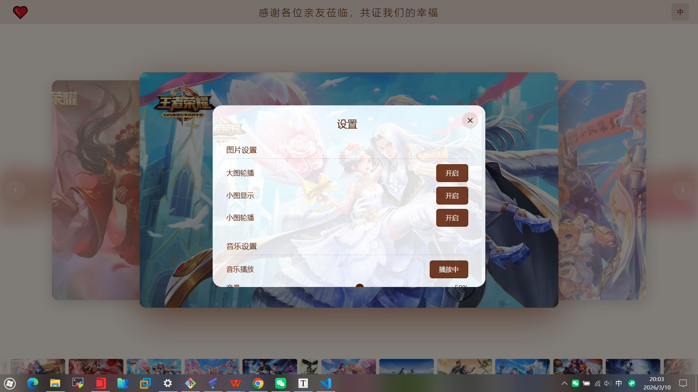

# Moment Carousel

一个精美的照片轮播展示系统，适用于婚礼、纪念日、活动展示等场景。

## 效果预览

### 横图轮播效果


### 竖图轮播效果


### 设置面板


## 功能特性

- **3D 图片轮播** - 支持3D过渡效果的主图轮播
- **小图胶片展示** - 底部胶片式小图自动滚动展示
- **背景音乐** - 随机播放背景音乐，支持列表循环
- **动态波浪背景** - 流畅的波浪动画背景
- **响应式设计** - 自适应不同屏幕尺寸
- **国际化支持** - 支持简体中文和英文切换
- **可配置项** - 大图轮播、小图显示、音乐播放等均可自由控制

## 快速开始

### 环境要求

- Node.js >= 20.17.0
- pnpm >= 8.15.9

### 安装依赖

```bash
pnpm install
```

### 开发运行

```bash
pnpm dev
```

### 构建生产版本

```bash
pnpm build
```

### 预览生产版本

```bash
pnpm preview
```

## 配置说明

### 图片配置

编辑 `src/config/photos.ts` 文件来配置轮播图片：

```typescript
export const photos = [
  '/images/1.jpg',
  '/images/2.jpg',
  // 添加更多图片路径...
]
```

将图片文件放入 `public/images/` 目录。

### 音乐配置

编辑 `src/config/musics.ts` 文件来配置背景音乐：

```typescript
export const musics = [
  '/musics/1.mp3',
  '/musics/2.mp3',
  // 添加更多音乐文件...
]
```

将音乐文件放入 `public/musics/` 目录。

### 国际化配置

语言文件位于 `locales/` 目录：

- `locales/简体中文/common.yml` - 简体中文
- `locales/English/common.yml` - 英文

## 使用说明

### 控制面板

点击左上角的红心按钮（❤️）打开设置面板，可以配置以下选项：

- **大图轮播** - 开启/关闭主图自动轮播
- **小图显示** - 开启/关闭底部小图显示
- **小图轮播** - 开启/关闭小图自动滚动
- **音乐播放** - 暂停/继续音乐播放
- **音量调节** - 滑动调节音乐音量

### 语言切换

点击右上角的「中/EN」按钮切换语言。

### 手动控制

- 点击左右箭头按钮切换图片
- 点击两侧的侧边图片快速切换
- 鼠标悬停在轮播区域会暂停自动轮播
- 鼠标移出后会恢复自动轮播

## 项目结构

```
moment-carousel/
├── public/                 # 静态资源目录
│   ├── images/           # 图片资源
│   └── musics/           # 音乐资源
├── src/
│   ├── components/       # Vue 组件
│   │   ├── BackgroundMusic.vue    # 背景音乐组件
│   │   ├── CarouselDots.vue       # 小图轮播组件
│   │   ├── CarouselViewer.vue    # 主图轮播组件
│   │   ├── SettingsModal.vue     # 设置弹窗组件
│   │   └── WaveBackground.vue    # 波浪背景组件
│   ├── config/          # 配置文件
│   │   ├── musics.ts   # 音乐配置
│   │   └── photos.ts   # 图片配置
│   ├── layouts/        # 布局组件
│   ├── pages/          # 页面组件
│   ├── plugins/        # 插件配置
│   ├── App.vue         # 根组件
│   └── main.ts         # 入口文件
├── locales/            # 国际化文件
├── index.html          # HTML 模板
├── package.json        # 项目配置
└── vite.config.ts     # Vite 配置
```

## 技术栈

- **Vue 3** - 渐进式 JavaScript 框架
- **TypeScript** - JavaScript 超集
- **Vite** - 新一代前端构建工具
- **UnoCSS** - 原子化 CSS 引擎
- **Vue I18n** - Vue 国际化插件

## 许可证

MIT License
